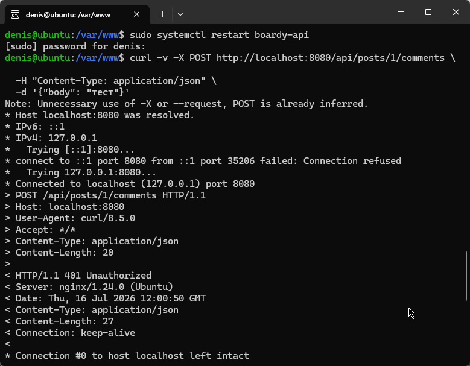
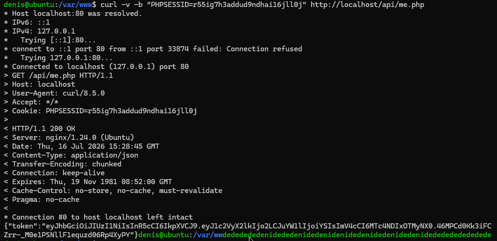
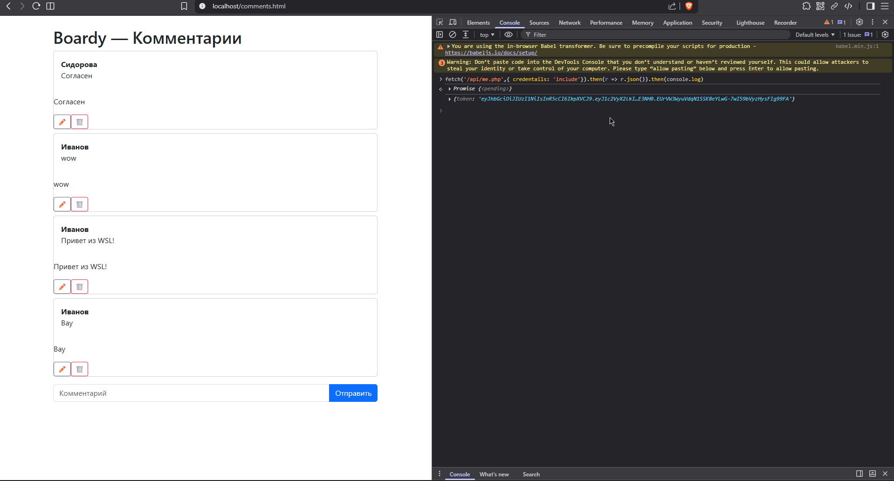
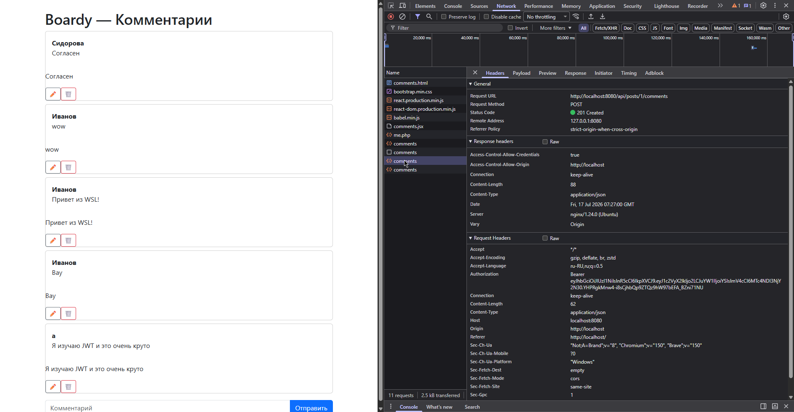
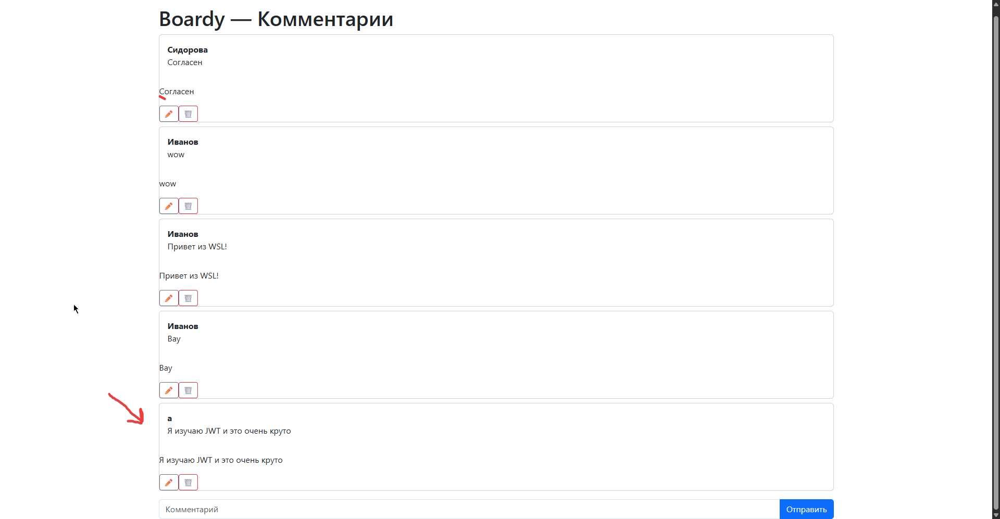
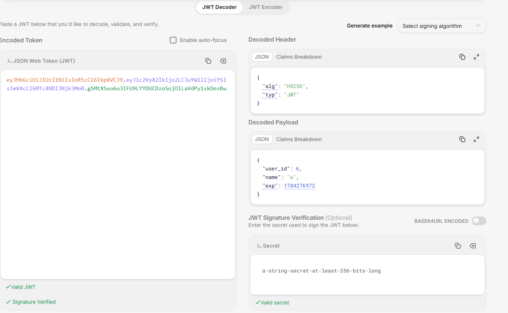
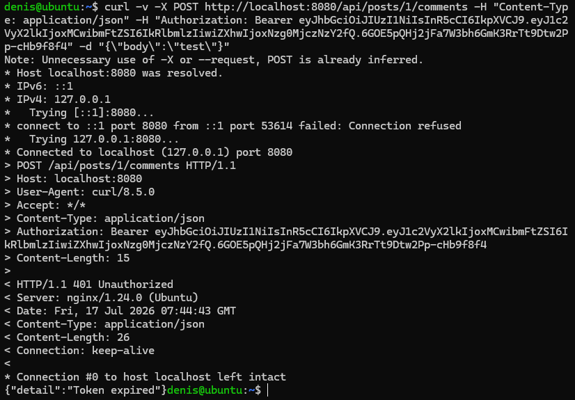
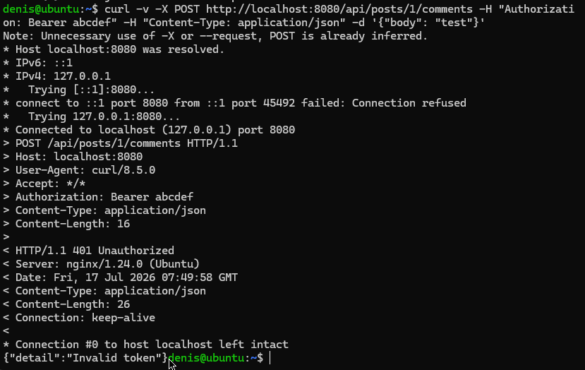
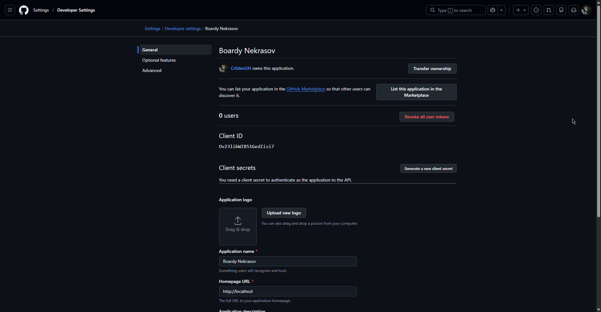
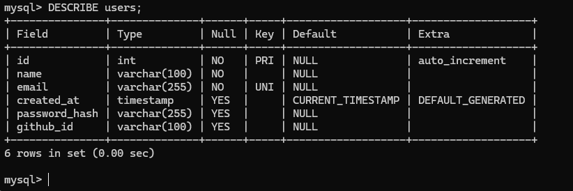
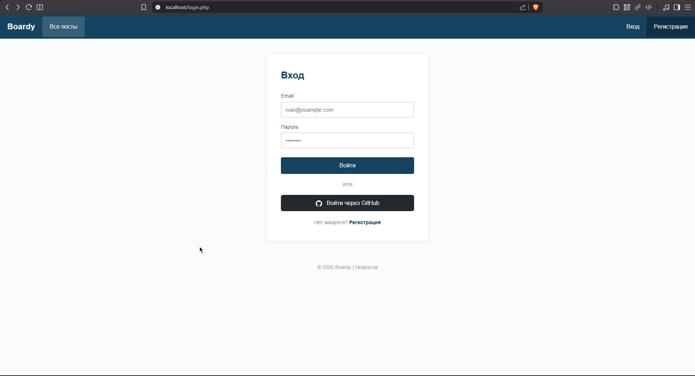
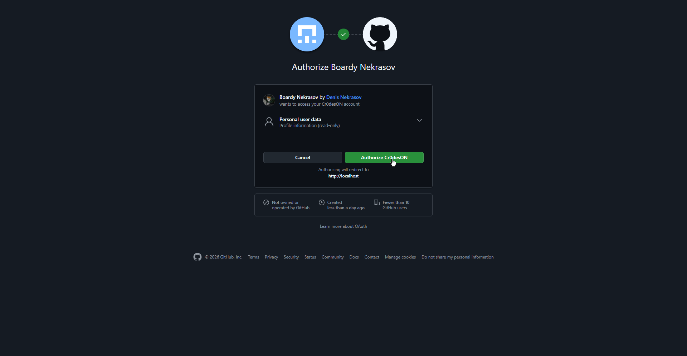
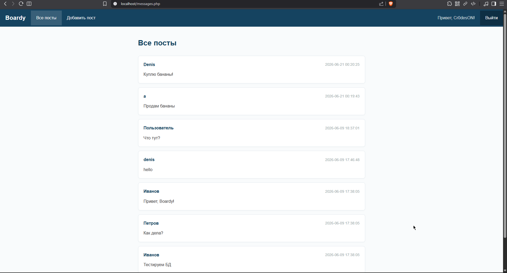
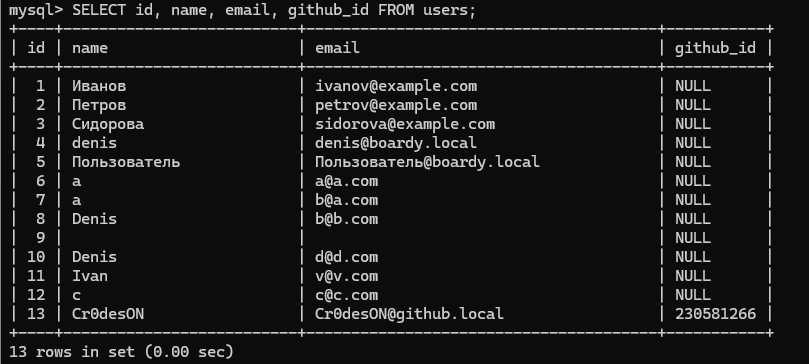
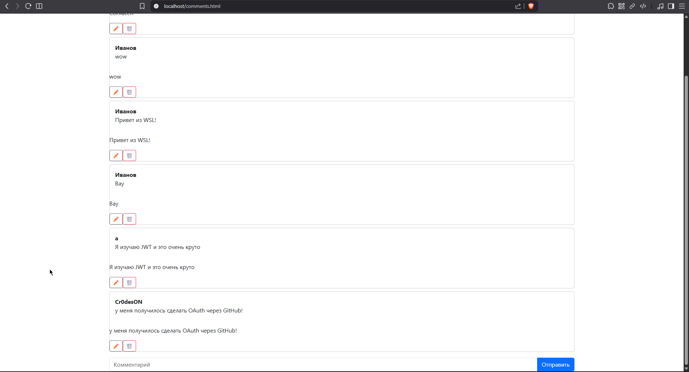
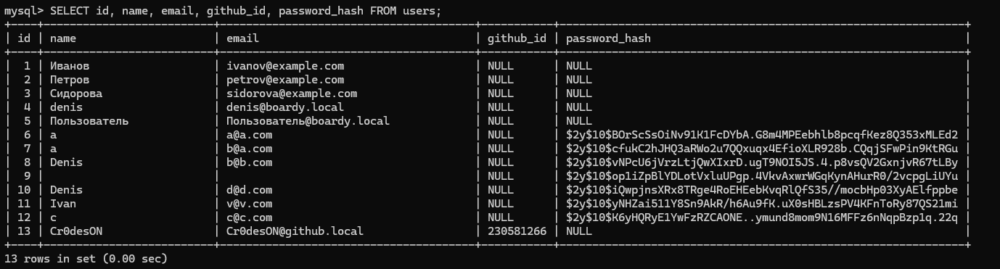

| Вопрос                      | Куки+сессии | JWT                | OAuth                      |
|-----------------------------|-------------|--------------------|----------------------------|
| Где хранятся данные?        | На сервере  | Внутри токена      | У провайдера               |
| Кто прикрепляет к запросу?  | Браузер     | Клиент             | Браузер один раз при входе |
| Для какого типа клиентов?   | Браузер     | Любой клиент       | Веб и мобильные приложения |
| Можно ли отозвать?          | Да          | Можно, но доп. код | Можно у провайдера         |
| Кросс-доменно работает?     | Нет         | Да                 | Да                         |
