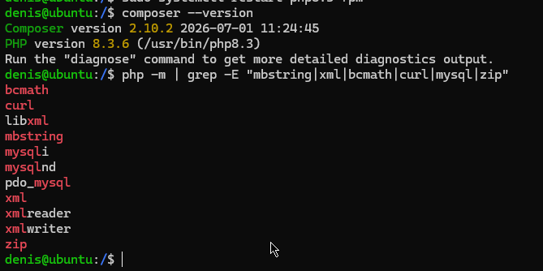
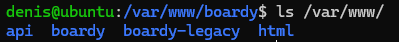
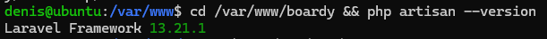

Одной фразой назначение пяти папок:  app/, routes/, resources/views/, database/, public/?
-app/ - само приложение 
-routes/ - маршруты url 
-resources/views/ - шаблоны
-database/ - связь с бд
-public/ - файлы проекта

Почему document_root nginx должен указывать на public/?
-Там находятся файлы, которые нужно отображать, в том числе index.php. В общей папке находятся конфигурационные файлы, которые браузеру не нужно открывать

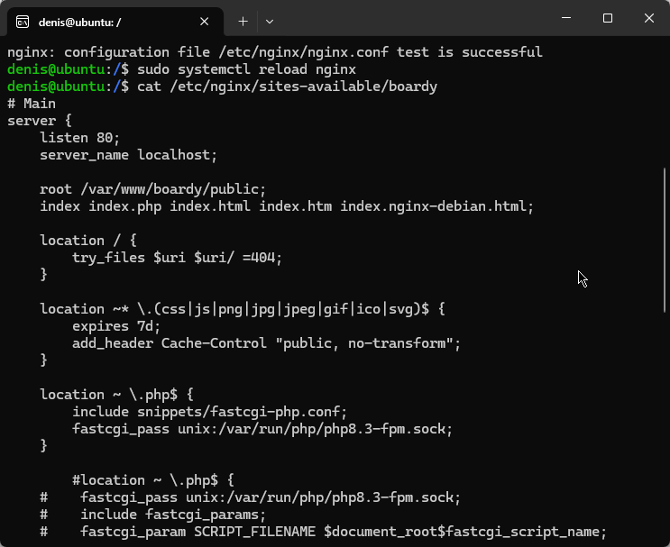
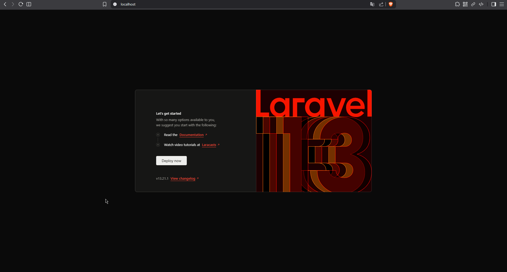
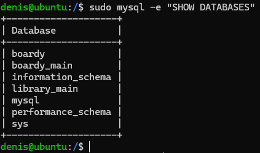
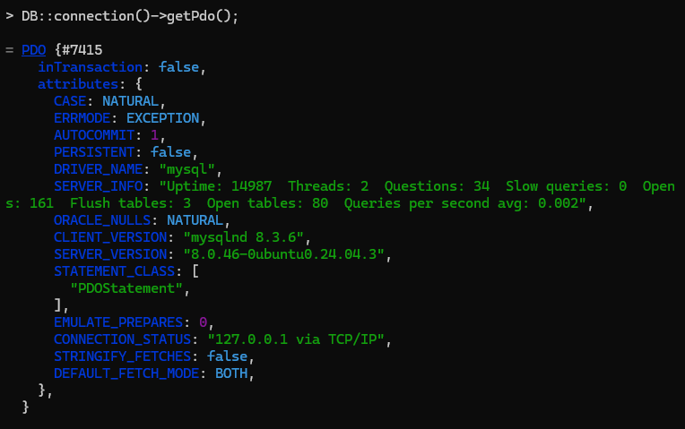
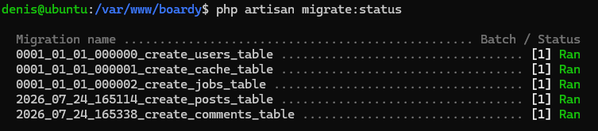
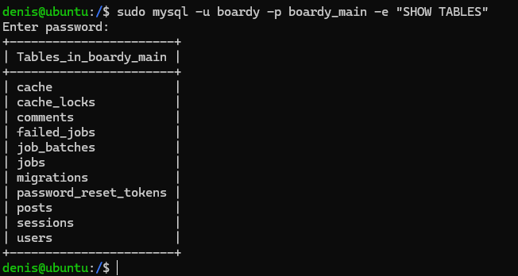
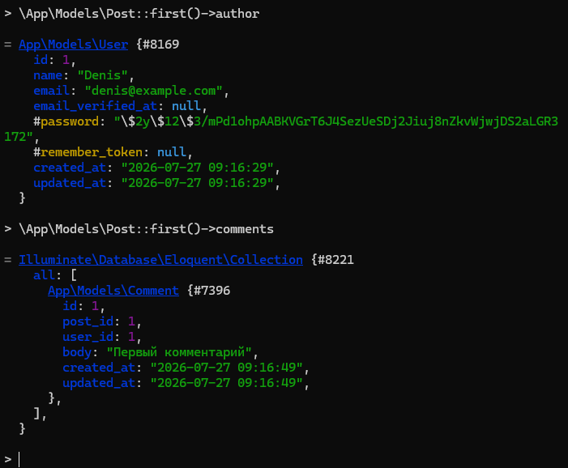
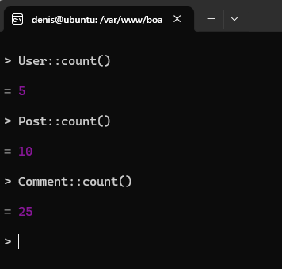
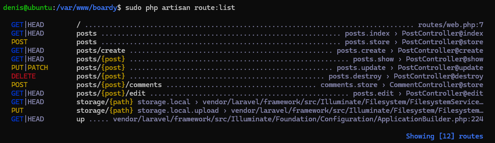
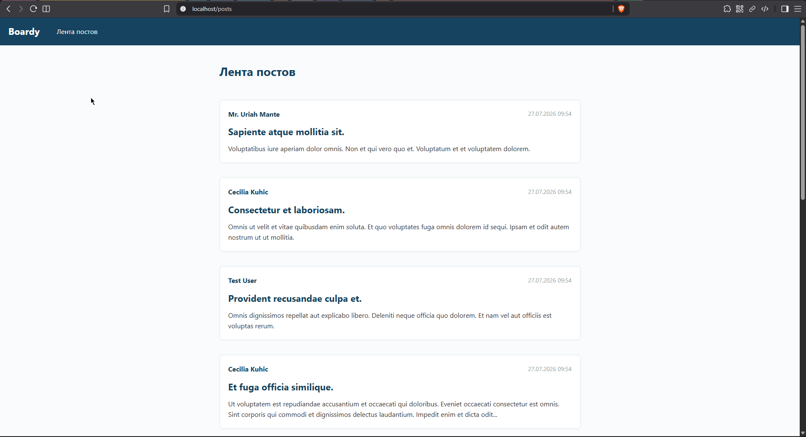
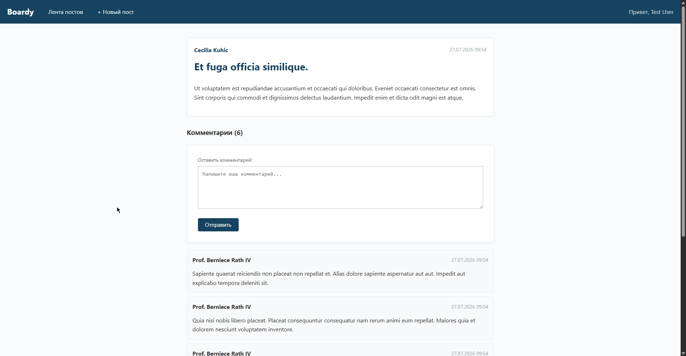
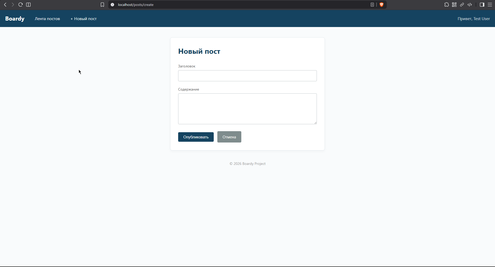
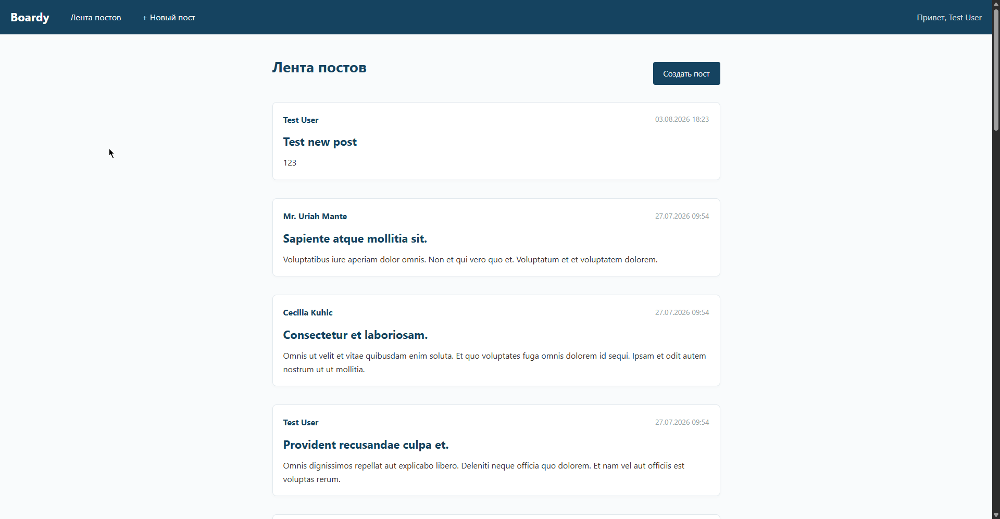
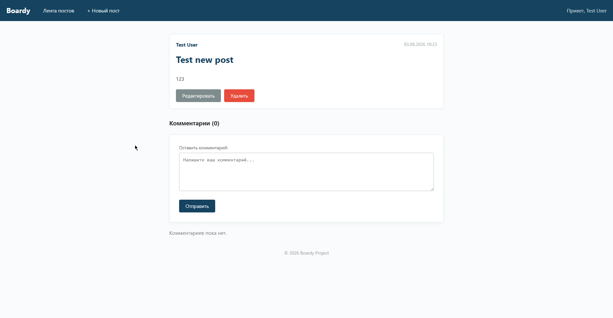
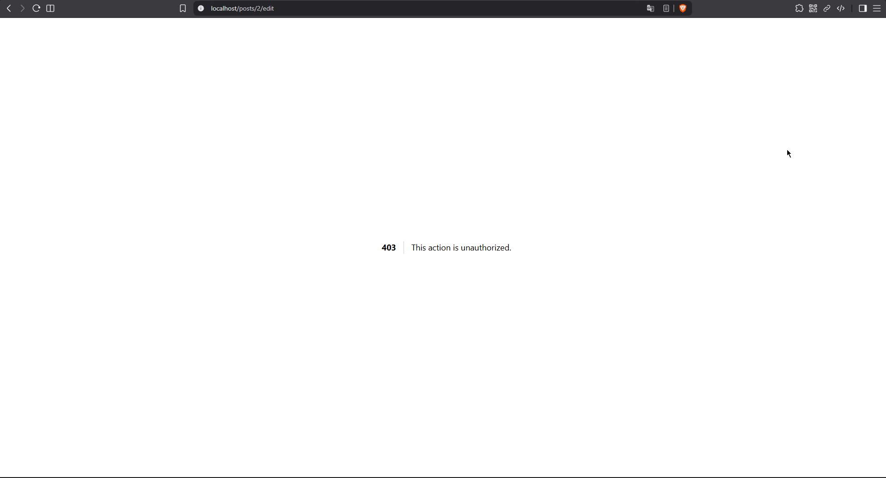
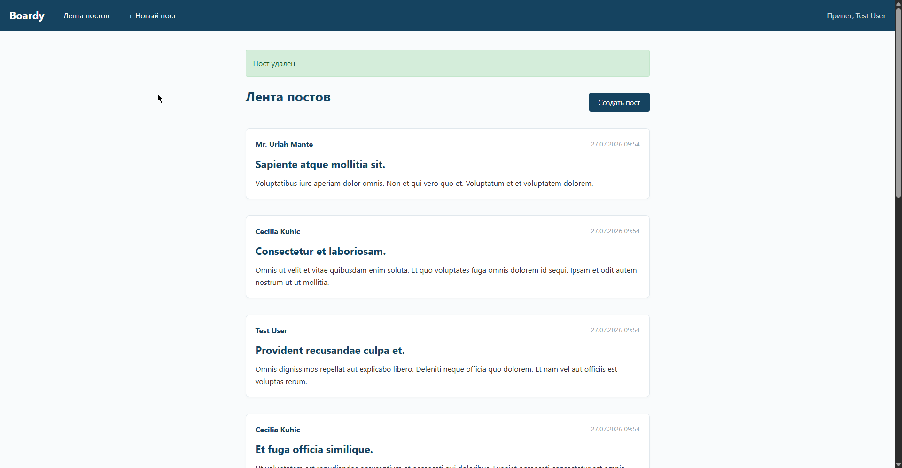
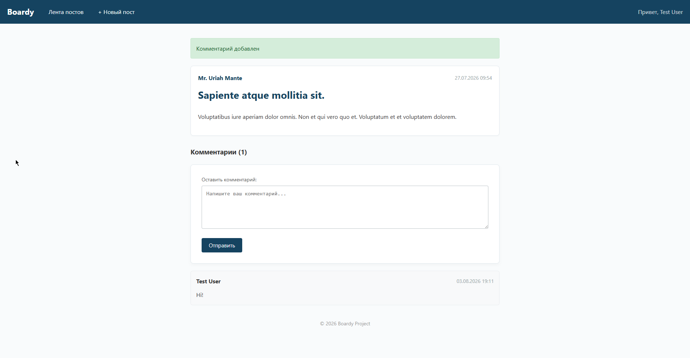

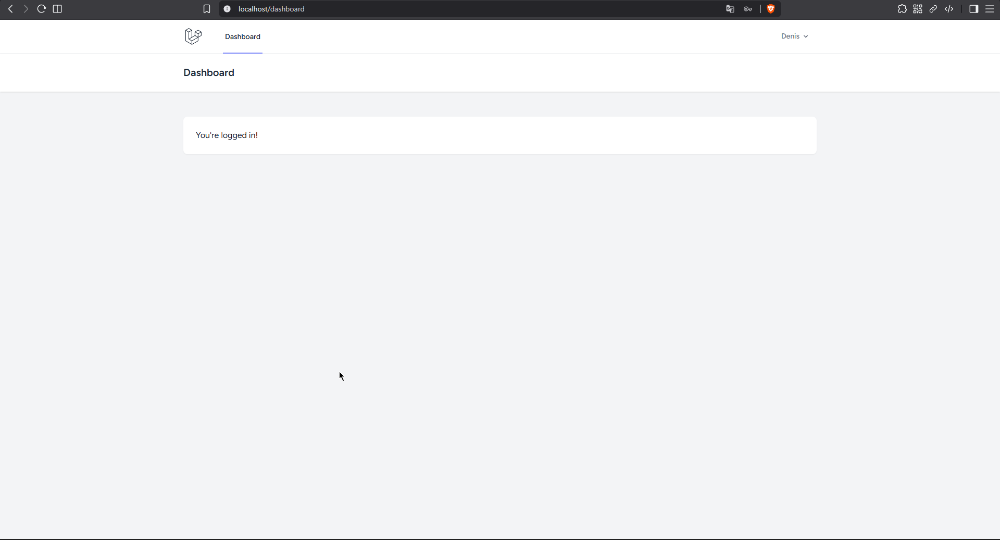
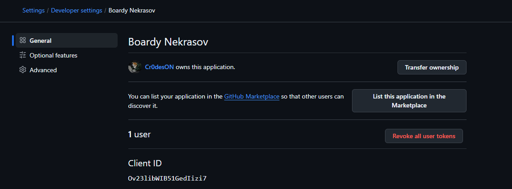

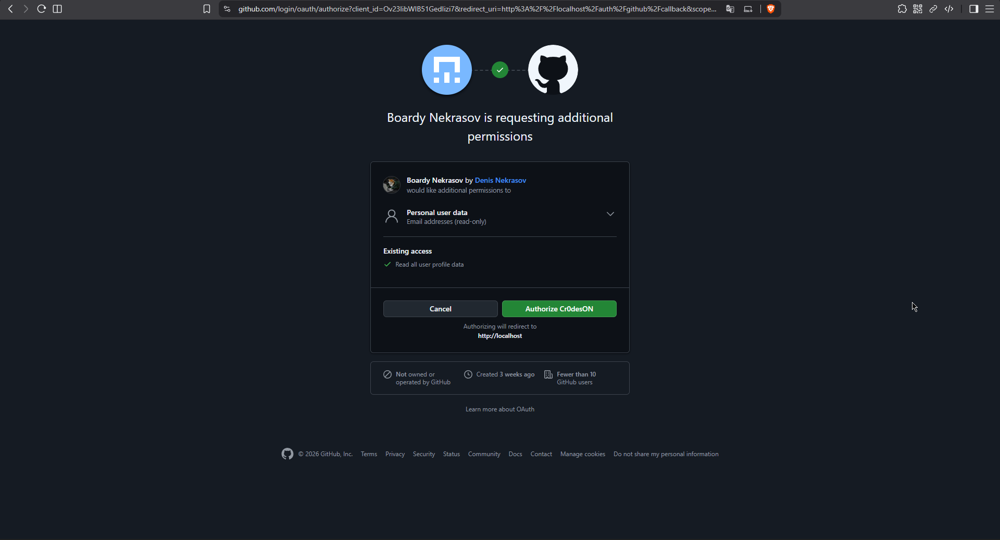
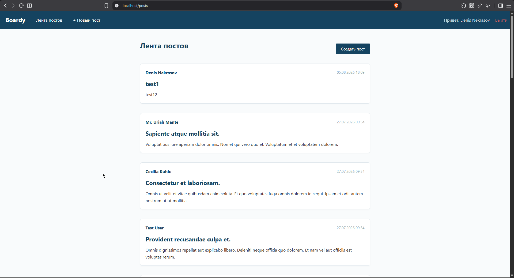
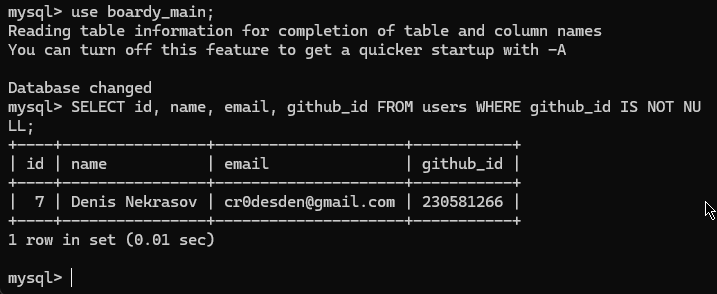